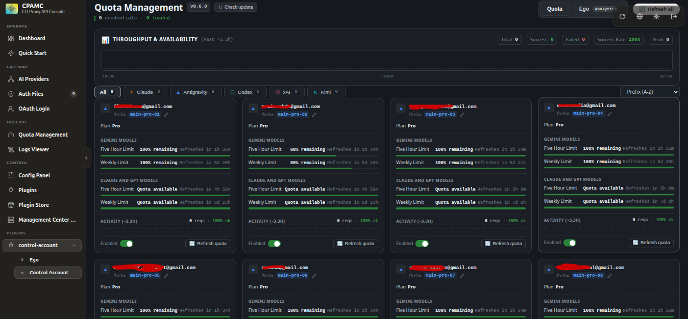
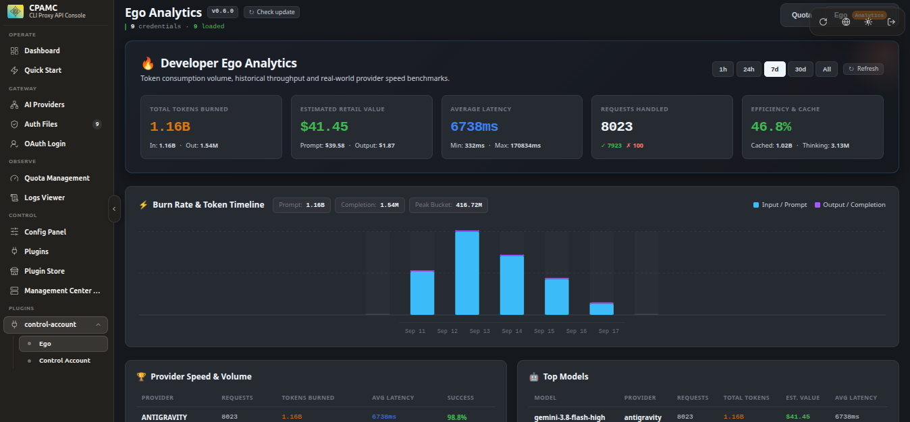
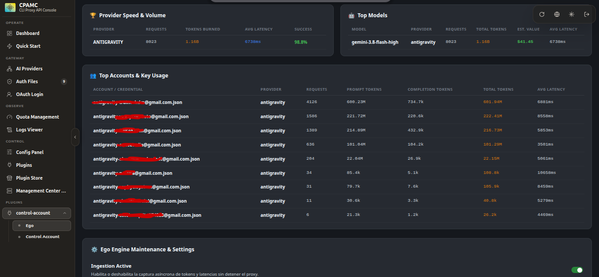

# CLIProxyAPI Control Account & Ego Analytics Plugin

[](https://github.com/Clowraider/cli-control-account/releases/latest)
[](https://golang.org)
[](https://opensource.org/licenses/MIT)

A standard C-ABI dynamic library plugin in Go for **[CLIProxyAPI](https://github.com/router-for-all/CLIProxyAPI)** that provides an embedded **Quota Management** and **Developer Ego Analytics** Single-Page Application (SPA) dashboard. Features dark theme, real-time upstream quota meters, synchronized per-account activity sparklines, provider filtering, interactive profile/prefix modification, token burn rate tracking, and retail cost equivalence in USD.

---

## 📸 Screenshots

### Quota Management Dashboard
Real-time quota monitoring, reset credit management, interactive prefix editing, per-account activity sparklines (~3.3h window), and throughput KPI metrics.



### Developer Ego Analytics
Aggregated token burn volume, prompt vs. output timeline, retail value estimation ($ USD), provider speed benchmarks, and model breakdown.



### Usage Breakdowns & Engine Controls
Top accounts and credential utilization, detailed latency profiles, and non-blocking asynchronous ingestion controls.



---

## ⚠️ Requirements

- **CLIProxyAPI ≥ v7.3.0**: This plugin uses `schema_version: 6` and management API routing (`/v0/management/ego/*`). CLIProxyAPI versions prior to v7.3.0 (such as v7.2.x, which only support `schema_version: 4`) will fail plugin registration with an ABI version mismatch (`plugin schema version 6 is not supported`) and return 404 on dashboard routes.

---

## 📦 Option 1: Quick Install with Precompiled Binaries (No compilation needed)

No Go toolchain or C compiler is required. Download the pre-built `.so` file for your platform directly from [GitHub Releases](https://github.com/Clowraider/cli-control-account/releases/latest):

| Platform / Architecture | Download Binary | Description |
|---|---|---|
| **Linux amd64** | `control-account-linux-amd64.so` | Standard Ubuntu / Debian / Docker x86_64 |
| **Linux arm64** | `control-account-linux-arm64.so` | Apple Silicon Docker / Raspberry Pi / AWS Graviton |

### 1. Place the binary in your plugins folder
```bash
mkdir -p plugins
# Copy downloaded binary directly to your plugins folder
cp /path/to/control-account-linux-amd64.so plugins/control-account-linux-amd64.so
```

### 2. Configure CLIProxyAPI `config.yaml`
```yaml
plugins:
  enabled: true
  dir: /app/plugins
  configs:
    control-account-linux-amd64:
      enabled: true
```

### 3. Docker & Docker Compose Setup
Mount the `./plugins` folder into your container:

```yaml
services:
  cliproxy:
    image: router-for-all/cli-proxy-api:latest
    ports:
      - "8000:8000"
    volumes:
      - ./config.yaml:/app/config.yaml
      - ./plugins:/app/plugins
```

Access the dashboards in your browser:
- **Quota Management Dashboard**:
  ```text
  http://localhost:8000/v0/resource/plugins/control-account-linux-amd64/quota
  ```
- **Developer Ego Analytics Dashboard**:
  ```text
  http://localhost:8000/v0/resource/plugins/control-account-linux-amd64/ego
  ```
  *(You can also seamlessly switch between Quota and Ego views via the top navigation bar inside the dashboard).*

---

## ✨ Features & Architecture

### 1. Live Quota & Per-Account Activity Synchronization
- **Upstream Providers**: Live quota querying for Google Antigravity, Anthropic Claude, OpenAI Codex, Kimi/Moonshot, and xAI (Grok).
- **Per-Credential Activity Sparklines**: Activity bar (~3.3h window), total requests, and success rate (% ok) automatically refresh alongside live quota checks, keeping metrics consistent without full page reloads.
- **Codex Reset Credits**: View and redeem available Codex reset credits directly from account cards.
- **Prefix & Routing Management**: Live pencil edit modal for account prefixes with automatic `Prefix (A-Z)` sorting.
- **Safety & Robustness**: Concurrency guards, 30s timeout handlers, fail-open defaults, and xAI token-burn protections during unattended auto-refresh.

### 2. Developer Ego Analytics & Token Valuation
- **Token Accounting Semantics**:
  - **Claude / Anthropic (`independent`)**: Prompt input tokens exclude cache, reasoning is additive to output, and cache creation is priced at 1.25x.
  - **Gemini / Antigravity (`separateReasoning`)**: Prompt input includes cache, reasoning is additive to output.
  - **OpenAI / Codex (`subset`)**: Prompt input includes cache, reasoning is a subset of completion tokens.
- **Embedded Pricing Database**: Integrated offline pricing catalog covering ~4,300 models to calculate retail cost equivalence in $ USD against flat subscription rates.
- **Multi-Resolution Timelines**: 5-minute buckets for 1h view; hourly and daily buckets for 24h, 7d, 30d, and All-time views.
- **Storage & Privacy Hardening**: Local SQLite database stored at `~/.cliproxy/ego.db` with restricted file permissions (`0700` directory, `0600` database file). Asynchronous non-blocking event worker and authenticated management endpoints (`/v0/management/ego/*`).

---

## 🛠️ Option 2: Local Compilation & Testing for Developers

If you want to modify the plugin and test it locally on your Ubuntu machine with Docker before pushing new versions:

### Method A: Compile Directly on Ubuntu Host
If you have Go 1.22+ and GCC installed on your Ubuntu host:
```bash
# 1. Compile the dynamic library (builds control-account-linux-amd64.so)
make build
# Or manually with version injection:
go build -buildmode=c-shared -ldflags="-s -w -X control-account/internal/version.Version=0.6.0" -o control-account-linux-amd64.so main.go

# 2. Copy the resulting .so directly to your Docker plugins directory
cp control-account-linux-amd64.so /ruta/a/tu/docker/plugins/control-account-linux-amd64.so
```

### Method B: Compile inside Docker (Zero host dependencies)
If you prefer not to install Go or GCC on your host, compile inside an ephemeral container that exactly matches Linux Docker ABI:
```bash
docker run --rm -v "$(pwd)":/src -w /src golang:1.22 \
  go build -buildmode=c-shared -ldflags="-s -w" -o control-account-linux-amd64.so main.go
```

### Run Test Suite Locally
```bash
# Run tests with race detector:
go test -v -race ./...
```

---

## 📁 Repository Structure

```text
cli-control-account/
├── .github/workflows/release.yml     # Automated Linux amd64 / arm64 CI/CD builds
├── Makefile                          # Build & test automation
├── go.mod                            # Go module definition
├── main.go                           # C-ABI entry point & authenticated management router
├── main_test.go                      # Unit tests for C-ABI entry point
├── img/                              # Dashboard screenshots
│   ├── quota-management.png          # Quota management screenshot
│   ├── ego-analytics-overview.png    # Ego analytics overview & timeline
│   └── ego-analytics-breakdown.png   # Usage breakdowns & engine settings
├── internal/
│   ├── ego/                          # Developer Ego analytics engine
│   │   ├── handler.go                # Authenticated REST API handler (/v0/management/ego/*)
│   │   ├── models.go                 # Analytics & usage event models
│   │   ├── pricing.go                # Token semantics (independent, separateReasoning, subset) & rates
│   │   ├── storage.go                # Hardened SQLite storage (0700/0600 permissions, auto-migration)
│   │   └── worker.go                 # Non-blocking async event ingestion worker
│   ├── handlers/                     # HTTP resource handler & security headers
│   │   ├── resource.go
│   │   └── resource_test.go
│   ├── lifecycle/                    # Host lifecycle event definitions
│   │   ├── events.go
│   │   └── events_test.go
│   ├── models/                       # Quota domain models & prefix formatting
│   │   ├── quota.go
│   │   └── quota_test.go
│   ├── version/                      # Plugin version (injected via -ldflags)
│   │   ├── version.go
│   │   └── version_test.go
│   └── web/                          # Embedded SPA web assets
│       ├── embed.go
│       ├── embed_test.go
│       └── assets/
│           └── index.html            # Unified Quota & Ego Analytics SPA
└── README.md
```

---

## License

MIT License. See [LICENSE](LICENSE) for details.
